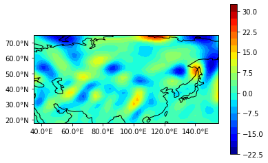

```python
import numpy as np
import matplotlib.pyplot as plt
import cartopy.crs as ccrs
from cartopy.mpl.ticker import LongitudeFormatter, LatitudeFormatter


f=open('D:\\nc\\uwnd2013.grd','r')
a=np.fromfile(f,dtype=np.float32) #经过测试每个数据被认为是4字节
f.close()
ul=a.reshape(604,17,28,53)

#u[1,29,0]  #第一个数就是grads中y-1，第二个数是x-1，最后一个数就是u，这是一个三维数组


f=open('D:\\nc\\vwnd2013.grd','r')
a=np.fromfile(f,dtype=np.float32) #经过测试每个数据被认为是4字节
f.close()


vl=a.reshape(604,17,28,53)


w=np.ones((53,28))     #创建一个三维数组，用来存放涡度

```


```python
#ul[0,0,:,0]  # 现在是t z y x 结构 经与grads比对无误
```


```python
#转置u v 数组，使之看起来更爽
u=np.transpose(ul,(3,2,1,0))  #换成了 x y z t 结构，括号里的数字可以看成是圆数组索引 trans-pose 即转变姿势
v=np.transpose(vl,(3,2,1,0)) 


#数组切片，取出想要的数组并重新命名，这里尝试numpy切片
u500=u[:,:,5,578]   #切出了500hPa,t=579(grads)的u
v500=v[:,:,5,578]
```


```python
#看一下u500，v500的形状以验证切片的正确性
#u500.shape

u=u500
v=v500

```


```python
#Calculate vor
wei=2.5*np.pi/180
i=1
while (i<52):
    j=1
    while (j<27):
        w[i,j]=100000*((v[i+1,j]-v[i-1,j])/(wei*np.cos((2.5*j+12.5)*np.pi/180))-(u[i,j+1]-u[i,j-1])/wei+2*u[i,j]*np.tan(np.cos((2.5*j+12.5)*np.pi/180)))/(2*6371000)
        j=j+1
    i=i+1

```


```python
#计算涡度平流u*/x +v*/y
p=np.zeros((53,28)) #用来存放涡度平流 
i=2
while (i<51):
    j=2
    while (j<26):
        p[i,j]=100000*(u[i,j]*(w[i+1,j]-w[i-1,j])/(wei*np.cos((2.5*j+12.5)*np.pi/180))+v[i,j]*(w[i,j+1]-w[i,j-1])/wei)/(2*6371000)
        j=j+1
    i=i+1


```


```python
#确定要画的经纬度，这里ctl中2.5的信息被使用到了
x=np.arange(35,157.5,2.5)  #50+
y=np.arange(17.5,77.5,2.5)  #20+
X,Y = np.meshgrid(x,y)

```


```python
#Z.shape
#X
#Y
```


```python
X.shape
```


    (24, 49)


```python
#注意：由于是中央差分法算的涡度，所以边界值是没有的，涡度图要看起来小一圈，即使在grads中也相同，涡度平流图要小两圈
Z=p[2:51,2:26].T     #X，Y分别是画图时的（x，y）坐标，转置后贴入
```


```python
 #fig = plt.figure(figsize=(8, 3))
ax = plt.axes(projection=ccrs.PlateCarree())                       #用cartopy的语句，具体还未细看
cp = plt.contourf(X,Y,Z,20,transform=ccrs.PlateCarree(), cmap='jet')  #20值的是分成20等分，使图片看起来更加精细。
ax.coastlines()
plt.colorbar(cp)


#ax.set_extent([0, 180, 0, 87.5])  一种地图扩展

ax.set_xticks([40, 60, 80, 100, 120, 140,])   #坐标轴中标记
ax.set_yticks([20,30,40,50,60,70])


#添加如°N这样的标记
lon_formatter = LongitudeFormatter(number_format='.1f',degree_symbol='°', dateline_direction_label=True)
lat_formatter = LatitudeFormatter(number_format='.1f',degree_symbol='°')
ax.xaxis.set_major_formatter(lon_formatter)
ax.yaxis.set_major_formatter(lat_formatter)
plt.savefig("D:\\nc\\u850.png",dpi=600)#设定图片分辨率
plt.show()
```





```python

```


```python

```
